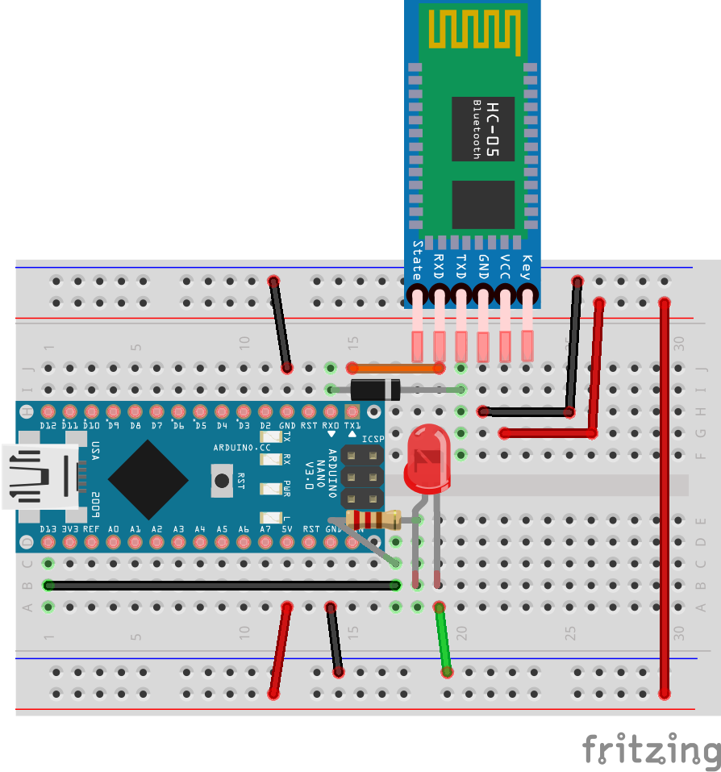
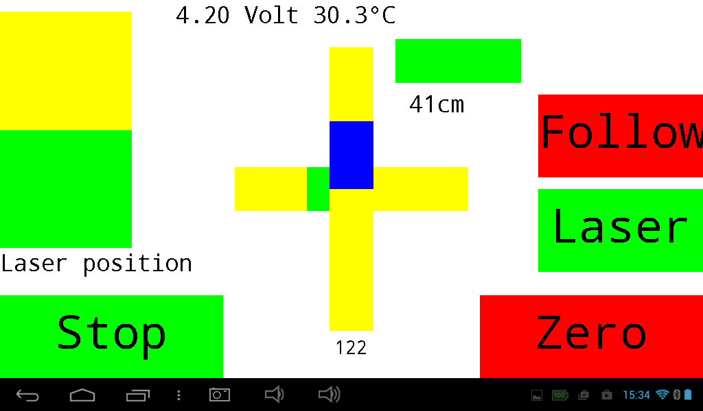

<div align = center>

# [BlueDisplay](https://github.com/ArminJo/Arduino-BlueDisplay)
This library enables an Android smartphone / tablet to act as a graphical display for your Arduino or ESP32.<br/>

[](https://www.gnu.org/licenses/gpl-3.0)
 &nbsp; &nbsp;
[](https://github.com/ArminJo/Arduino-BlueDisplay/releases/latest)
 &nbsp; &nbsp;
[](https://github.com/ArminJo/Arduino-BlueDisplay/commits/master)
 &nbsp; &nbsp;
[](https://github.com/ArminJo/Arduino-BlueDisplay/actions)
 &nbsp; &nbsp;

<br/>
<br/>
[](https://stand-with-ukraine.pp.ua)

Available as [Arduino library "BlueDisplay"](https://www.arduinolibraries.info/libraries/blue-display).

[](https://www.ardu-badge.com/BlueDisplay)
 &nbsp; &nbsp;
[](https://github.com/ArminJo/Arduino-BlueDisplay?tab=readme-ov-file#revision-history)

</div>

#### If you find this library useful, please give it a star.

&#x1F30E; [Google Translate](https://translate.google.com/translate?sl=en&u=https://github.com/ArminJo/Arduino-BlueDisplay)

<br/>


# BlueDisplay library for Arduino
With the BlueDisplay library you create the GUI for your application, e.g. **Graphics, Text, Buttons, Sliders and Charts** on the Arduino itself.<br/>
**No Android programming required!**<br/>
The Arduino is **connected via USB-cable or Bluetooth** with your smartphone / tablet, where the BlueDisplay app renders the GUI.
**GUI callback, touch and sensor events** are sent back to the Arduino, where they can be handled.<br/>
The Bluetooth connection can be achieved by using an **ESP32** or connecting a **HC-05** to the RX/TX pins of your Arduino.
Connecting the Arduino with an USB cable to your smartphone requires an USB-OTG adapter.<br/>

<br/>

# Features
- **Graphic + text** output as well as **printf implementation**.
- Draw **chart** from byte or short values. Enables clearing of last drawn chart.
- Play system tones.
- **Touch button + slider** objects with tone feedback and 16 bit values.
- Sliders can have arbitrary start and end values.
- Buttons can be **Red/Green toggle** button with different text for both states.
- Buttons can be **autorepeat buttons** with 2 different repeat rates.
- Button and slider callback as well as touch and **sensor events** are sent back to Arduino.
- Automatic and manually **scaling of display region**.
- Easy mapping of UTF-8 characters like Ohm, Celsius etc..
- Up to **115200 Baud** using **HC-05** modules or** USB OTG**.
- **USB OTG connection** can be used instead of Bluetooth.
- Local display of received and sent commands for debugging purposes.
- Hex and ASCII output of received Bluetooth data at **log level** verbose.
- **Debug messages as toasts**.

## Local graphic support
- [Thick line](https://github.com/ArminJo/Arduino-BlueDisplay/blob/master/src/LocalGUI/ThickLine.hpp) with Bresenham.
- Touch button + slider implementations for HX8347D and SSD1289 controller.
- Local event support for ADS7846 resistive touch controller.
- Local and remote displays can be used simultaneously and are synchonized when possible.


<br/>

# Installation
On Android, you need to install the [BlueDisplay app](https://play.google.com/store/apps/details?id=de.joachimsmeyer.android.bluedisplay).

<br/>

# Usage

```c++
//#define BLUETOOTH_BAUD_RATE BAUD_115200   // Activate this, if you have reprogrammed the HC05 module for 115200, otherwise 9600 is used as baud rate
#include "BlueDisplay.hpp"

// Declare callback handler for (re)connect and resize
void initDisplay(void);
void drawGui(void);

void setup() {
    initSerial(BLUETOOTH_BAUD_RATE); // Converted to Serial.begin(BLUETOOTH_BAUD_RATE) by default
    BlueDisplay1.initCommunication(&Serial,&initDisplay, &drawGui); // Introduces up to 1.5 seconds delay and calls initDisplay(), if BT connection is available
}
void loop() {
...
    checkAndHandleEvents();
}
void initDisplay(void) {
    // Initialize display size and flags
    BlueDisplay1.setFlagsAndSize(BD_FLAG_FIRST_RESET_ALL | BD_FLAG_USE_MAX_SIZE | BD_FLAG_TOUCH_BASIC_DISABLE, 320, 240);
    // Initialize all GUI elements here
 ...
}
void drawGui(void) {
    BlueDisplay1.clearDisplay(COLOR16_WHITE);
    // Draw all GUI elements here
...
}
```
<br/>

## Which Serial interface?
For boards which have more than one serial interface, the library tries to use **Serial1** for the BT connection to leave Serial, which is mostly connected to the USB, for other purposes as logging etc..
If you require **direct USB connection** to the smartphone / tablet by cable for this board, you must activate the macro [`USE_USB_SERIAL`](https://github.com/ArminJo/Arduino-BlueDisplay#compile-options--macros-for-this-library).<br/>
Another, but more more complicated, way is **to modify the central serial interface function of the library**.
You only have to change the [first 2 lines](src/BlueSerial.hpp#L224) of the function `sendUSARTBufferNoSizeCheck()` in *BlueSerial.hpp* according to your requirements.

<br/>

# Sensor axis for an Arduino application
Android axis are [defined for **natural screen orientation**](https://source.android.com/devices/sensors/sensor-types), which is portrait for my devices:
- When the device lies flat on a table and its left side is down and right side is up or pushed on its left side toward the right, the X acceleration value is positive.
- When the device lies flat on a table and its bottom side is down and top side is up or pushed on its bottom side toward the top, the Y acceleration value is positive.
- When the device lies flat on a table, the acceleration value along Z is +9.81 (m/s^2).

**The BlueDisplay application converts the axis, so that this definition holds for each screen orientation.**
For detailed information to sensors see [ShowSensorValues example](https://github.com/ArminJo/Arduino-BlueDisplay/blob/master/examples/ShowSensorValues/ShowSensorValues.ino)

<br/>

# Lines and anti-aliasing
Lines and vectors, that are not horizontal or vertical are drawn with anti-aliasing. 
This has the disadvantage that these lines cannot be removed witout residual by overwriting them with background color.
You must use the *WithAliasing() function variant if you have a diagonal line or vector that you want to remove by overwriting.

<br/>

# Using the new *.hpp files
In order to support [compile options](#compile-options--macros-for-this-library) more easily,
the line `#include <BlueDisplay.h>` must be changed to  `#include <BlueDisplay.hpp>`
in your main program (aka *.ino file with setup() and loop()).

In **all other files** you must use `#include <BlueDisplay.h>`, to **prevent `multiple definitions` linker errors**:

<br/>

# Compile options / macros for this library
To customize the library to different requirements, there are some compile options / macros available.<br/>
These macros must be defined in your program **before** the line `#include <BlueDisplay.hpp>` to take effect.<br/>
Modify them by enabling / disabling them, or change the values if applicable.

| Name | Default value | Description |
|-|-:|-|
| `BLUETOOTH_BAUD_RATE` | 9600 | Change this, if you have [reprogrammed](https://github.com/ArminJo/Arduino-BlueDisplay#btmoduleprogrammer) the HC05 module for another baud rate e.g.115200. |
| `DO_NOT_NEED_BASIC_TOUCH_EVENTS` | disabled | Disables basic touch events down, move and up. Saves up to 180 bytes program memory and 14 bytes RAM. |
| `DO_NOT_NEED_TOUCH_AND_SWIPE_EVENTS` | disabled | Disables LongTouchDown and SwipeEnd events. Saves up to 88 bytes program memory and 4 bytes RAM. |
| `ONLY_CONNECT_EVENT_REQUIRED` | disabled | Disables reorientation, redraw and sensor-change events. Saves up to 50 bytes program memory and 4 bytes RAM. |
| `BD_USE_SIMPLE_SERIAL` | disabled | Only for AVR! Do not use the Serial object. Saves up to 1250 bytes program memory and 185 bytes RAM, if Serial is not used otherwise. |
| `BD_USE_USB_SERIAL` | disabled | Activate it, if you want to force using **Serial** instead of **Serial1** for **direct USB cable connection** to your smartphone / tablet. This is only required on platforms, which have Serial1 available. |
| `SUPPORT_LOCAL_DISPLAY` | disabled | Supports simultaneously drawing on the locally attached display. Not (yet) implemented for all commands! |
| `DISABLE_REMOTE_DISPLAY` | disabled | Suppress drawing to Bluetooth connected display. Allow only drawing on the locally attached display. Not (yet) implemented for all commands! |
| `LOCAL_GUI_FEEDBACK_TONE_PIN` | disabled | If defined, local GUI library calls `tone(LOCAL_GUI_FEEDBACK_TONE_PIN, 3000, 50)` on flags like FLAG_BUTTON_DO_BEEP_ON_TOUCH. |
| `SUPPORT_ONLY_TEXT_SIZE_11_AND_22` | disabled | If defined, saves program memory especially for local GUI. |
| `LOCAL_DISPLAY_HEIGHT` | 240 | The height of the local diplay used by the LocalGUI library. |
| `LOCAL_DISPLAY_WIDTH` | 320 | The width of the local diplay used by the LocalGUI library. |

<br/>

# Display Unicode characters with `setCharacterMapping()`
if we want to use special characters to display, we face the problem, that we can only send ASCII codes to be displayed. But fortunately the ASCII code table has at least 128 "unused" entries between 0x80 and 0xFF, normally used for the local codepage.<br/>
But with `setCharacterMapping(<ASCII_value>, <UTF16_value>)` you can modify this codepage, i.e display the character <UTF16_value> if you send <ASCII_value>, which has to be between 0x80 and 0xFF.<br/>
Since the 2. parameter for setCharacterMapping is 16 bit, you cannot use characters whose Unicode code is higher than 0xFFFF like the electric light bulb (U+1F4A1 from https://www.fileformat.info/info/unicode/char/1f4a1/index.htm).

### Example

``` c++
    BlueDisplay1.setCharacterMapping(0x87, 0x2227); // mapping for unicode AND used as Forward symbol
    BlueDisplay1.setCharacterMapping(0x88, 0x2228); // mapping for unicode OR used as Backwards symbol
    BlueDisplay1.setCharacterMapping(0x81, 0x03A9); // Omega in UTF16
    0x03A9 is Omega, 0x0394 is Delta, 0x21B2 is Enter, 0x21E7 is Ascending, 0x21E9 is Descending in UTF16
    0x2302 is Home, 0x2227 is UP (logical AND), 0x2228 is Down (logical OR), 0x2195 is UP/Down, 0x2103 is Degree Celsius in UTF16
```

<br/>

# Using another Codepage with `setCodePage()`
By default, the local codepage of the Android system is used for display special characters above 0x7F.<br/>
But if you have a [codepage](https://en.wikipedia.org/wiki/Windows_code_page) which better fits your needs and you want to use as your default code page, you can change it with `setCodePage(<ISO_8859_Number>)`. Internally it is done on Android with `Charset.forName("ISO_8859_" + <ISO_8859_Number>)`.

<br/>

# Element positioning
## Text 
- Text Y position is upper left corner of character
- Text Y bottom position is position + TextSize
- Text Y middle position is position + TextSize / 2

### before version 5.0 we had:
- Text Y position is baseline of character.
- Text Y top position is (Y position - ascend) - use getTextAscend(TextSize).
- Text Y bottom position is position + descend.
- Text Y middle position is position - ((ascend - descend) / 2) - see getTextMiddleCorrection().
- Text position for local implementation is upper left corner of character.


## Button and Slider
- Slider position is upper left corner of slider
- Button position is upper left corner of button

# Specials
- If color of text or button is `COLOR16_NO_BACKGROUND` no background is rendered for text and button (Only-text button).
- If drawChartcolor is `COLOR16_NO_DELETE`, the old chart will not be cleared. This is used for the "history" function for the DSO example.

<br/>

# [Examples](examples)
Before using the examples, take care that the Bluetooth-module (e.g. the the HC-05 module) or ESP32 program is connected to your Android device and is visible in the Bluetooth Settings.

All examples initially use the **baud rate of 9600**. Especially the SimpleTouchScreenDSO example will run smoother with a baud rate of 115200.<br/>
For this, change the example baud rate by deactivating the line `#define BLUETOOTH_BAUD_RATE BAUD_9600` and activating `#define BLUETOOTH_BAUD_RATE BAUD_115200`.<br/>
**AND** change the Bluetooth-module baud rate e.g. by using the BTModuleProgrammer.ino example.<br/>
For ESP32 no baud rate must be specified :-).

## BlueDisplayBlink
Simple example to check your installation.
| With debug output as "Toast" after pressing the "Stop" button | Breadboard |
| :-: | :-: |
|  |  |

<br/>

## BlueDisplayExample
More elaborated example to show more features of the BlueDisplay library.
| Screenshot | Graphics test page with additional thick red lines |
| :-: | :-: |
|  |  |
| Fritzing schematic for BlueDisplay example | BlueDisplay example breadboard picture |
|  |  |

<br/>

## ManySlidersAndButtons
Example for 8 / 16 sliders and 8 buttons to control 8 / 16 analog values and 6 functions of an arduino application.
Buttons can be Red/Green toggle buttons. Includes the implementation of a 4 value slider with user provided text value.


<br/>

## ChartForMHZ19_CO2
A full display GUI displaying 4 days of CO2 values with BlueDisplay chart.


<br/>

## UltimateBatteryTester
Screenshot from the [Ultimate-Battery-Tester example running in BlueDisplay mode](https://github.com/ArminJo/Ultimate-Battery-Tester?tab=readme-ov-file#features).


<br/>

## TouchGuiDemo
Demo of the GUI: LocalTouchButton, LocalTouchSlider and Chart as well as the programs Game of Life and Draw Lines.<br/>
If a local display is attached, two additional pages, show font and ADS7846 A/D channels are enabled.
| TouchGuiDemo main page | Chart page |
| :-: | :-: |
|  |  |
| Game Of Life start page | Game Of Life page |
|  |  |
| Draw page | Settings page |
|  |  |

<br/>

## ShowSensorValues
Shows the accelerometer and gyroscope values received from the smartphone both graphical and numerical.


<br/>

## BTModuleProgrammer
Simple helper program to configure your HC-05 or JDY-31 modules name and default baud rate with a serial monitor.
It can also be used to enter AT commands directly to the BT module for extended manual programming.<br/>


Sample outputs can be found [here](https://github.com/ArminJo/Arduino-BlueDisplay/tree/master/examples/BTModuleProgrammer).

<br/>

## RcCarControl
Example of controlling a RC-car by smartphone accelerometer sensor.

| RC car control display | Hacked RC car |
| :-: | :-: |
|  |  |

<br/>

## ServoExample
The accelerometer sensor of the android display is used to control two servos in a frame which holds a laser.
This is an example for using a fullscreen GUI.<br/>
If no BD connection available, the servo first marks the border and then moves randomly in this area (Cat Mover).<br/>
- Zero -> the actual sensor position is taken as the servos 90/90 degree position.
- Bias (reverse of Zero) -> take actual servos position as position for horizontal sensors position.
- Auto move -> moves randomly in the programmed border. Currently horizontal 45 to 135 and vertical 0 to 45.

| Screenshot | Bias setting |
| :-: | :-: |
|  |  |

<br/>

## **SimpleTouchScreenDSO**
300 kSamples DSO without external hardware (except the HC-05 module). For AC input, only a capacitor and 4 resistors are needed.
More information at [Arduino-Simple-DSO](examples/SimpleTouchScreenDSO).<br/>
Not for STM32.
| DSO start screen | DSO chart screen with long info |
| :-: | :-: |
|  |  |

<br/>

## US_Distance
Shows the distances measured by a HC-SR04 ultrasonic sensor. Can be used as a parking assistance.


<br/>

# Random delays on some smartphones
Depending on the device you use, you can observe some random **"delays"** up to 500 ms in the timing of the display refresh.
The **delays does not occur if you use a USB connection** instead of the Bluetooth one.<br/>
The reason is, that the Android Bluetooth driver does not return its received bytes for a longer time.<br/>
If you send to much data during this delay the **driver may hang**, as you can observe for the SimpleDSO Application, which runs **smooth with a USB** connection.<br/>
But I also got this kind of problems with an USB connection with my Samsung SM-T560.<br/>
A hint is how often the error `RPCView Read delay > 1000ms for missing bytes.` can be seen in the log.
It looks like some errors of this kind are tolerable, but if they are too often, then we schould increase the delays between the data sent.<br/>
Hanging may be avoided if using flow control, but the HC05 firmware and HC05 breakout boards do not support it.
And flow control with USB resets the board :-(.
On the ESP32, the BluetoothSerial library supports flow control and there you can observe that the client program also delays, when the smartphone driver takes its break.<br/>
This Bluetooth driver is usually delivered by the hardware vendor, so it may depend on the chips used in your smartphone.
It seems, that some Bluetooth SPP (Serial Port Profile) drivers are not really specified/tested/optimized for real time behavior.<br/>
Known devices **with** these "delays" are:<br/>
Lenovo K3 Note 6.0, Nexus7 with AW-NH665 BT-Chip running 6.0.1, Nexus 6P with ?8.x?, Kindle Fire HD 8 with Broadcom BCM2076 running 6.3.1.5.<br/>
Known devices **without** these "delays" are:<br/>
Samsung Note 3 running 5.0, Lifetab P9702 running 7.1.2, Lifetab E10310 running 4.2.2, XORO PAD 721 running 4.2.2, Samsung Galaxy S3 GT-I9300 running Lineage 7.1.2, LUX10 running 5.0, iRULU X11 running 5.1.1, Time2 TC1050G running 5.1, Pixel 4 XL running 10.

Using a delay of HELPFUL_DELAY_BETWEEN_DRAWING_CHART_LINES_TO_STABILIZE_<USB or BT>_CONNECTION before or after sending chart values can help.

# Extras
The extras folder (in the Arduino IDE use "Sketch > Show Sketch Folder" (or Ctrl+K) and then in the libraries/BlueDisplay/extras directory)
contains more schematics, breadboard layouts and pictures which may help you building the example projects.

# Hints
### Opening the apps menu
For full screen applications, the app's menu is called by swiping horizontal from the left edge of the screen.
Otherwise, you can call it by touching the area not occupied by the client application (black display area).

### Debugging
If you need debugging, you can use the `debug()` functions or the old `Serial.print()` will do.<br/>
Keep in mind that a message is shown for at least 500 ms, before another one is accepted.

```c++
BlueDisplay1.debug("DoBlink=", doBlink);
```
The debug content will then show up as **toast** on your Android device and is stored in the log.
Change the **log level** in the app to see more or less information of the BlueDisplay communication.

### Connecting Arduino RX
To enable programming of the Arduino while the HC-05 module is connected, use a Schottky diode
(e.g. a BAT 42) to connect **Arduino RX and HC-05 TX**.
On Arduino MEGA 2560, TX1 is used, so no diode is needed.
```
                 |\ |
   Arduino-rx ___| \|___ HC-05-tx
                 | /|
                 |/ |
```

# Revision History
### Version 5.0.0
- Text Y and X position is upper left corner of character.
- Added `setCallback()` and `setFlags()` for buttons and sliders.
- Modified ManySlidersAndButtons example.
- Screen orientation flags now also possible in setFlagsAndSize().

### Version 4.4.0 - The version compatible with app version 4.4
- Removed `mMaxDisplaySize`, because it was just a copy of `CurrentDisplaySize`.
- Renamed `getDisplaySize()` to `getRequestedDisplaySize()` etc.
- Renamed `drawVectorDegrees()` to `drawVectorDegree()`.
- Added functions `draw*WithAliasing()`.
- Added slider function `setMinMaxValue()`.
- Refactored and improved Chart.
- Minor bug fixes.
- Added a full screen example for a log chart of CO2 values.
- Added the convenience function `clearTextArea()`.
- Changed value of `COLOR16_NO_DELETE`.
- Renamed `DO_NOT_NEED_TOUCH_AND_SWIPE_EVENTS` to `DO_NOT_NEED_LONG_TOUCH_DOWN_AND_SWIPE_EVENTS`.
- `BD_FLAG_TOUCH_BASIC_DISABLE` is always set if `DO_NOT_NEED_BASIC_TOUCH_EVENTS` is defined.
- Improved BTModuleProgrammer program.

### Version 4.0.1
- Minor changes and updated 3. party libs.

### Version 4.0.0
- Major refactoring, many bug fixes and seamless support of local display.
- All `*Rel*()` functions now have signed delta parameters.
- Fixed bugs in `drawLineRelWithThickness()` and button list for local display.
- Added `debug(const __FlashStringHelper *aStringPtr)`.
- Added `bool delay(AndCheckForEvent()`.

### Version 3.0.2
- Added function setPosition() for sliders.
- Fixed bug in macros `BLUE ` and `COLOR32_GET_BLUE`.

### Version 3.0.1
- ADCUtils now external sources.

### Version 3.0.0
- Improved BTModuleProgrammer program.
- Renamed *.cpp to *.hpp.

### Version 2.2.0
- Changed default serial for AVR from `USE_SIMPLE_SERIAL` to standard Arduino Serial.
- Added ShowSensorValues example.
- Renamed mReferenceDisplaySize to mRequestedDisplaySize and renamed related function to getRequestedDisplaySize().
- New function `setBarThresholdDefaultColor`. Requires BlueDisplay app version 4.3.
- New function `setPositiveNegativeSliders(..., aValue, aSliderDeadBand)`.
- Renamed `setPrintf*` functions to `setWriteString*`.
- Switched last 2 parameters in `initCommunication()` and the 3. parameter is now optional.
- Compatible with MegaCore supported CPU's.

### Version 2.1.1
- New function `setCaptionFromStringArrayPGM()`.
- Added flag `sBDEventJustReceived`.

### Version 2.1.0
- Arduino Due support added.
- New command `FUNCTION_CLEAR_DISPLAY_OPTIONAL` to enable resynchronizations of slow displays. Used by SimpleTouchScreenDSO.

### Version 2.0.0
- ESP32 and ESP8266 support added. External BT module required for ESP8266.

### Version 1.3.0
- Added `sMillisOfLastReceivedBDEvent` for user timeout detection.
- Fixed bug in `debug(const char *aMessage, float aFloat)`.
- Added `*LOCK_SENSOR_LANDSCAPE` and `*LOCK_SENSOR_LANDSCAPE` in function `setScreenOrientationLock()`. Requires BlueDisplay app version 4.2.
- Removed unused `mCurrentDisplayHeight` and `mCurrentDisplayWidth` member variables.
- Fixed bug in draw function from `drawByte` to `drawLong`.
- Added short `drawText` functions. Requires BlueDisplay app version 4.2.

### Version 1.2.0
- Use type `Print *` instead of `Stream *`.
- New function `initSerial()`
- Changed parameter `aTextSize` to `uint16_t` also for AVR specific functions.

### Version 1.1.0
- Porting to STM32.

### Version 1.0.1
- Changed default baud rate for all examples to `9600`.
- Renamed `USART_send()` to `sendUSART()`.
- DSO example Version 3.1.

### Version 1.0.0
Initial Arduino library version

# Old Revision History corresponding to the Android BlueDisplay App
### V 3.7
- Handling of no input for getNumber.
- Slider setScaleFactor() does not scale the actual value, mostly delivered as initial value at init().

### V 3.6
- connect, reconnect and autoconnect improved/added. Improved debug() command. Simplified Red/Green button handling.

### V 3.5
- Slider scaling changed and unit value added.

### V 3.4
- Timeout for data messages. Get number initial value fixed.
- Bug autorepeat button in conjunction with UseUpEventForButtons fixed.

### V 3.3
- Fixed silent tone bug for Android Lollipop and other bugs. Multiline text /r /n handling.
- Android time accessible on Arduino. Debug messages as toasts. Changed create button.
- Slider values scalable. GUI multi touch.Hex and ASCII output of received Bluetooth data at log level verbose.

### V 3.2
- Improved tone and fullscreen handling. Internal refactoring. Bugfixes and minor improvements.

### V 3.1
- Local display of received and sent commands for debug purposes.

### V 3.0
- Android sensor accessible by Arduino.

# CI
The library examples are tested with GitHub Actions for the following boards:

- arduino:avr:uno
- arduino:avr:leonardo
- arduino:avr:mega
- esp8266:esp8266:huzzah:eesz=4M3M,xtal=80
- esp32:esp32:featheresp32:FlashFreq=80
- STMicroelectronics:stm32:GenF1:pnum=BLUEPILL_F103C8

## Requests for modifications / extensions
Please write me a PM including your motivation/problem if you need a modification or an extension.
