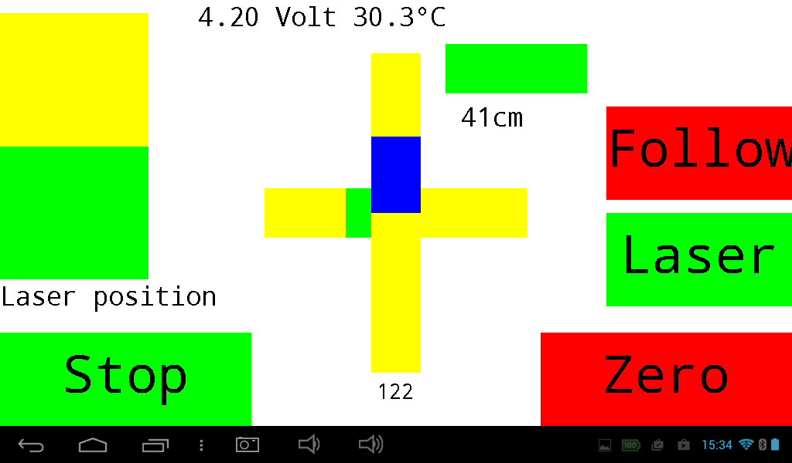

# [BlueDisplay](https://github.com/ArminJo/Arduino-BlueDisplay) Library for Arduino
Available as Arduino library "BlueDisplay"

### [Version 2.0.0](https://github.com/ArminJo/Arduino-BlueDisplay/releases)

[](https://www.gnu.org/licenses/gpl-3.0)
[](https://www.ardu-badge.com/Arduino-BlueDisplay)
[](https://github.com/ArminJo/Arduino-BlueDisplay/commits/master)
[](https://github.com/ArminJo/Arduino-BlueDisplay/actions)
[](https://github.com/brentvollebregt/hit-counter)

This library enables an Android smartphone / tablet to act as a graphical display for your Arduino or ESP32.

## SUMMARY
With the BlueDisplay library you create the GUI with **Graphics, Text, Buttons and Sliders** and their callbacks on the Arduino.
The Arduino is connected via USB-cable or Bluetooth with your smartphone / tablet where the BlueDisplay app renders the GUI.
GUI callback, touch and sensor events are sent back to the Arduino.<br/>
**No Android programming needed!**<br/>
Bluetooth connection can be achieved by using an ESP32 or connecting a HC-05 to the RX/TX pins of your Arduino.
Connecting the Arduino with an USB cable to your smartphone requires an USB-OTG adapter.<br/>

# Installation
Install this "BlueDisplay" library with *Tools -> Manage Libraries...* or *Ctrl+Shift+I*. Use "BlueDisplay" as filter string.<br/>
On Android you need to install the [BlueDisplay app](https://play.google.com/store/apps/details?id=de.joachimsmeyer.android.bluedisplay).

## Features
- Graphic + text output as well as printf implementation.
- Draw chart from byte or short values. Enables clearing of last drawn chart.
- Play system tones.
- Touch button + slider objects with tone feedback.
- Button and slider callback as well as touch and sensor events are sent back to Arduino.
- Automatic and manually scaling of display region.
- Easy mapping of UTF-8 characters like Ohm, Celsius etc..
- Up to 115200 Baud using HC-05 modules.
- USB OTG connection can be used instead of Bluetooth.
- Local display of received and sent commands for debugging purposes.
- Hex and ASCII output of received Bluetooth data at log level verbose.
- Debug messages as toasts.

## Which Serial interface?
For boards which have more than one serial interface, the library tries to use **Serial1** for the connection to leave Serial, which is mostly connected to the USB, for other purposes as logging etc..
If you require **direct USB connection** to the smartphone / tablet by cable for this board, you must open the library file *BlueSerial.h* and comment out the line `#define USE_USB_SERIAL`.<br/>
Another way is to **modify the central serial interface function**. You only have to change the first 2 lines of the function `sendUSARTBufferNoSizeCheck()` in *BlueSerial.cpp* according to your requirements.

# [Examples](examples)
Before using the examples, take care that the Bluetooth-module (e.g. the the HC-05 module) or ESP32 program is connected to your Android device and is visible in the Bluetooth Settings.

All examples initially use the baudrate of 9600. Especially the SimpleTouchScreenDSO example will run smoother with a baudrate of 115200.<br/>
For this, change the example baudrate by deactivating the line `#define BLUETOOTH_BAUD_RATE BAUD_9600` and activating `#define BLUETOOTH_BAUD_RATE BAUD_115200`.<br/>
**AND** change the Bluetooth-module baudrate e.g. by using the BTModuleProgrammer.ino example.<br/>
For ESP32 no baudrate must be specified :-).

## BlueDisplayBlink
Simple example to check your installation.

## BlueDisplayExample
More elaborated example to show more features of the BlueDisplay library.

## BTModuleProgrammer
Simple helper program to configure your HC-05 or JDY-31 modules name and default baudrate with a serial monitor.

## RcCarControl
Example of controlling a RC-car by smartphone accelerometer sensor.

## ServoExample
The accelerometer sensor of the android display is used to control two servos in a frame which holds a laser.
This is an example for using a fullscreen GUI.<br/>
If no BD connection available, the servo first marks the border and then moves randomly in this area (Cat Mover).<br/>
- Zero -> the actual sensor position is taken as the servos 90/90 degree position.
- Bias (reverse of Zero) -> take actual servos position as position for horizontal sensors position.
- Move -> moves randomly in the programmed border. Currently horizontal 45 to 135 and vertical 0 to 45.

## **SimpleTouchScreenDSO**
300 kSamples DSO without external hardware (except the HC-05 module). For AC input, only a capacitor and 4 resistors are needed.
More information at [Arduino-Simple-DSO](examples/SimpleTouchScreenDSO).<br/>
Not for STM32.

## US_Distance
Shows the distances measured by a HC-SR04 ultrasonic sensor. Can be used as a parking assistance.

## Random delays
Depending on the device you use, you can observe some random **"delays"** up to 500 ms in the timing of the display refresh. 
The **delays does not occur if you use a USB connection** instead of the Bluetooth one.<br/>
The reason is, that the Bluetooth driver does not return its received bytes for a longer time.<br/>
If you send to much data during this delay the **driver may hang**, as you can observe for the SimpleDSO Application, which runs **smooth with a USB** connection. Hanging may be avoided if using flow control, but the HC05 firmware and breakout boards do not support it. On the ESP32, the BluetoothSerial library supports it and there you can observe that the client program also delays, when the smartphone driver takes its delay.<br/>
This Bluetooth driver is usually delivered by the hardware vendor, so it may depend on the chips used in your smartphone.<br/>
In my opinion some Bluetooth SPP (Serial Port Profile) drivers are not really specified/tested/optimized for real time behavior.<br/>
Known devices **with** these "delays" are:<br/>
Lenovo K3 Note 6.0, Nexus7 with AW-NH665 BT-Chip running 6.0.1, Nexus 6P with ?8.x?, Kindle Fire HD 8 with Broadcom BCM2076 running 6.3.1.5.<br/>
Known devices **without** these "delays" are:<br/>
Samsung Note 3 running 5.0, Lifetab P9702 running 7.1.2, Lifetab E10310 running 4.2.2, XORO PAD 721 running 4.2.2, Samsung Galaxy S3 GT-I9300 running Lineage 7.1.2, LUX10 running 5.0, iRULU X11 running 5.1.1, Time2 TC1050G running 5.1, Pixel 4 XL running 10, 

## Extras
The extras folder (in the Arduino IDE use "Sketch/Show Sketch Folder" (or Ctrl+K) and then in the libraries/BlueDisplay/extras directory)
contains more schematics, breadboard layouts and pictures which may help you building the example projects.

## Hints
### Debugging
If you need debugging, you must use the `debug()` functions since using `Serial.print()` etc. gives errors (we have only one serial port on the Arduino). 
```
BlueDisplay1.debug("DoBlink=", doBlink);
```
The debug content will then show up as **toast** on your Android device and is stored in the log.
Change the **log level** in the app to see more or less information of the BlueDisplay communication.

### Connecting TX
To enable programming of the Arduino while the HC-05 module is connected, use a diode (eg. a BAT 42) to connect Arduino rx and HC-05 tx.
On Arduino MEGA 2560, TX1 is used, so no diode is needed.
```
                 |\ |
   Arduino-rx ___| \|___ HC-05-tx
                 | /|
                 |/ |
```

| Fritzing schematic for BlueDisplay example | BlueDisplay example breadboard picture |
| :-: | :-: |
|  |  |
| RC car control display | Hacked RC car |
|  |  |

# Revision History
### Version 2.1.0
- New command FUNCTION_CLEAR_DISPLAY_OPTIONAL to enable resynchronization of slow displays. Used by SimpleTouchScreenDSO.

### Version 2.0.0
- ESP32 and ESP8266 support added. External BT module needed for ESP8266.

### Version 1.3.0
- Added `sMillisOfLastReceivedBDEvent` for user timeout detection.
- Fixed bug in `debug(const char* aMessage, float aFloat)`.
- Added `*LOCK_SENSOR_LANDSCAPE` and `*LOCK_SENSOR_LANDSCAPE` in function `setScreenOrientationLock()`. Needs BD app version 4.2.
- Removed unused `mCurrentDisplayHeight` and `mCurrentDisplayWidth` member variables.
- Fixed bug in draw function from `drawByte` to `drawLong`.
- Added short `drawText` functions. Needs BD app version 4.2.

### Version 1.2.0
- Use type `Print *` instead of `Stream *`.
- New function `initSerial()`
- Changed parameter `aTextSize` to `uint16_t` also for AVR specific functions.

### Version 1.1.0
- Porting to STM32.

### Version 1.0.1
- Changed default baud rate for all examples to `9600`.
- Renamed `USART_send()` to `sendUSART()`.
- DSO example Version 3.1.

### Version 1.0.0
Initial Arduino library version

# Old Revision History corresponding to the Android BlueDisplay App
### V 3.7
Handling of no input for getNumber.
Slider setScaleFactor() does not scale the actual value, mostly delivered as initial value at init().
### V 3.6
connect, reconnect and autoconnect improved/added. Improved debug() command. Simplified Red/Green button handling.
### V 3.5
Slider scaling changed and unit value added.
### V 3.4
Timeout for data messages. Get number initial value fixed.
Bug autorepeat button in conjunction with UseUpEventForButtons fixed.
### V 3.3
Fixed silent tone bug for Android Lollipop and other bugs. Multiline text /r /n handling.
Android time accessible on Arduino. Debug messages as toasts. Changed create button.
Slider values scalable. GUI multi touch.Hex and ASCII output of received Bluetooth data at log level verbose.
### V 3.2
Improved tone and fullscreen handling. Internal refactoring. Bugfixes and minor improvements.
### V 3.1
Local display of received and sent commands for debug purposes.
### V 3.0
Android sensor accessible by Arduino.

# CI
Since Travis CI is unreliable and slow, the library examples are now tested with GitHub Actions for the following boards:

- arduino:avr:uno
- arduino:avr:leonardo
- arduino:avr:mega
- esp8266:esp8266:huzzah:eesz=4M3M,xtal=80
- esp32:esp32:featheresp32:FlashFreq=80
- STM32:stm32:GenF1:pnum=BLUEPILL_F103C8

## Requests for modifications / extensions
Please write me a PM including your motivation/problem if you need a modification or an extension.

#### If you find this library useful, please give it a star.
